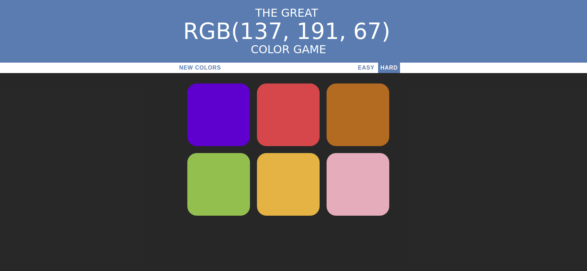

# Color-Game
An interesting color game written in HTML, CSS and Javascript

[TRY IT NOW !](https://jadez.me/Projects/ColorGame/index.html)

## Rules

Select the correct RGB encoded color according to the prompt 




## How to play ?

1. Clone this repository
2. Open ```index.html```
3. Enjoy !
